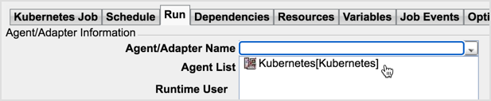

Kubernetes Adapter is a functional connection software layer providing the means to automate performing operations in a Kubernetes cluster. You don’t experience the adapter directly but rather use it as infrastructure for connecting TA instances with the applicable Kubernetes clusters.

Currently, the operations supported by the adapter come down to Job Creating and Command Running. Those operations you perform in the interface of TA web client.

The Quick Start guide leads you through the sequence of basic configuration procedures you need to master in the web client to be able to perform the operations supported for Kubernetes:

* **Creating a Connection** — establishing a link between your instance and Kubernetes cluster.
* **Creating a Job** — configuring a job to be performed in the Kubernetes cluster.
* **Running a Command** — configuring a command to run in the Kubernetes cluster.
* **Creating Objects** — configuring objects to be created in the Kubernetes cluster.

:::note
The configuration procedures below list only the steps pertinent to Kubernetes Adapter. Don’t be confused by the fact that some fields are left untouched and follow the procedures to the letter to get the declared results.
:::
---
## Creating Objects in Kubernetes Cluster

The latest adapter version supports adding the following objects: Config Map, Deployment, Persistent Volume Claim, Pod, Replica Set, and Service.

The objects creation procedure has two parts: ***configuring job parameters*** and ***adding objects***. The first part is identical for all the objects supported, therefore it occupies first place in the procedure. The second part is different for various objects as those objects have different configurations.

To create objects, follow these steps:

### Configuring Job Parameters

1. In the **Definitions** section of the **Navigation** pane, click **Jobs**.  
The **Jobs** section appears in the **Objects** pane.

  

2. In the **Jobs** section’s header, click **Add**  > Kubernetes Adapter.  
The **Kubernetes Job Definition** dialog appears.

  

3. Enter the following fields to identify the job in your instance:

    * **Kubernetes Job Name**: arbitrary alphanumeric characters (max. length: 1000).
    * **Owner**: a user having the right to edit the job created.
    * **Parent Group**: members of the parent group selected are enabled with the right to edit the job created.

4. On the **Run** tab in the **Agent/Adapter Name** drop-down list, select the connection you’ve created.

  

5. On the **Kubernetes Job** tab in the **Job Type** drop-down list, select **Kubernetes Objects**.

  

6. On the **Kubernetes Objects** tab, decide on both the way of the job run and the job steps execution mechanism to use:

    * **Dry Run**: select the checkbox if you intend the configured job to be only validated when scheduled or leave it empty if you intend the actual job run to be performed when scheduled.
    * **Wait for operations to complete**: select the checkbox to complete the job steps one by one; leave the checkbox empty to complete the job steps in parallel.

7.	On the **Steps** tab, enter the namespace for objects creation:

    * **Fetch**  (required): loads all the namespaces from the Kubernetes cluster into the **Namespaces** drop-down list.
    * **Namespace** (required): in the drop-down list, select a namespace to create objects at.

    

8.	Fill out the **Job Steps** table. The table serves as a configuration file according to which the objects will be created in your Kubernetes cluster upon the job completion. In simple words, each job step is an object you’d like to create in your Kubernetes cluster: Config Map, Deployment, Persistent Volume Claim, Pod, Replica Set, and Service.

9.	Click the step line in the **Job Steps** table and move it with the arrows to establish the proper sequence of the steps you added.

### Adding Persistent Volume Claim (PVC)

1. In the **Job Steps** table, click **Add** to open the **Add Job Step** dialog.

  

2. On the **General** tab of the **Add Job Step** dialog, fill in the general parameters of the step you’re adding:

    * **Step Name** (required): any alphanumeric characters to identify your step.
    *	**Kind**: in the drop-down list, select **PersistentVolumeClaim**.
    *	**Operation Type**: select Create as the operation to be performed for your object.

  

3. On the **General** tab of the **Persistent Volume Claim** tab, configure the parameters of the object you’re going to add:

    * **Name** (required): any alphanumeric characters to identify your object.
    * **Storage Class**: the field is disabled by default; to request a particular class of storage, enable the field (select **On**) and specify the name of a Storage Class. Otherwise default class will be set.
    * **Volume Name**: any alphanumeric characters to uniquely identify your volume.
    * **Volume Mode**: select the applicable Volume Mode (`Filesystem` or `Block`); note that Filesystem is the default mode used when the **Volume Mode** parameter is omitted.
    * **Access Mode**: select the access modes your Persistent Volume to support; note that the field is a multiple choice one, and the access modes selected will be placed into the box below where you can manage those selections (Delete/Clear).

  

4. On the **Resources** tab of the **Persistent Volume Claim** tab, specify your resource types and quantities as `key-value` pairs:

    * **Requests**: `key` is the type of resource and `value` is the amount of the resource being requested.
    * **Limits**: `key` is the type of resource and `value` is the maximum amount of the resource that will be made available.

5. On the **Selector** tab of the **Persistent Volume Claim** tab, specify the selector to further filter the set of volumes. The selector can consist of two fields:

    * **Match Labels**: the volume must have a label with this value; add a map of key-value pairs.
    * **Match Expressions**: a list of requirements made by specifying key, list of values, and operator that relates the key and values. Valid operators include `In`, `NotIn`, `Exists`, `DoesNotExist`.

    All of the requirements, from both Match Labels and Match Expressions, are ANDed together — they must all be satisfied in order to match.

6. Check all the object parameters set on the **Persistent Volume Claim** tab by switching to the **YAML** tab that shows the YAML configuration file for this object, and then click **OK** to add the configured Job Step.

  
