The Quick Start guide leads you through the sequence of basic operations for setting the Adapter for ServiceNow:

*	**Creating Runtime Users** — creating users corresponding to the ones by which you log into the ServiceNow instances you’d like to connect to.
*	**Connecting to ServiceNow Instances** — providing the URL and the user of the corresponding ServiceNow instance, you interlink Tidal Automation with it.
*	**Setting Actions** — selecting actions to be performed in a ServiceNow instance for a particular event.
*	**Setting Events** — selecting events and associating them with the actions you set earlier.

For guide’s clarity, you are going to deal just with the bare minimum steps, meaning that the adapter is configured with regards to the obligatory fields only.

To obtain a larger picture of all the setting options provided, see the "Configuring the Adapter: Description" section giving a full description of all the functionality you might come across dealing with the basic operations dialogs upon configuring the Adapter for ServiceNow in the Tidal Automation Web Client.

---

## Creating Runtime Users

To create a Runtime User, follow the steps:

1. In the **Administration** section of the **Navigation** pane, select **Runtime Users**.  
The **Runtime Users** section will appear in the **Objects** pane.

 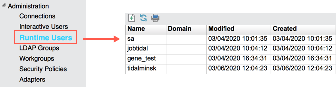

2. In the **Objects** pane’s header, click **Add**.
The **User Definition** dialog will appear.

 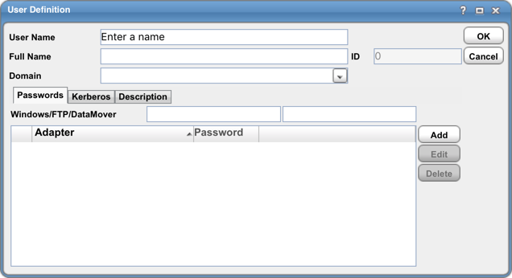

3. In the **User Name** field, enter the user name by which you log into the ServiceNow instance you’d like to connect to.

 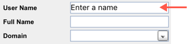

4. On the **Passwords** tab, click **Add** () to provide the password by which you log into the ServiceNow instance under this user. In the **Password Type** drop-down list, select `ServiceNow`; in the password fields enter and confirm the password, then click **OK**.

 

5.	In the **User Definition** dialog, click **OK**.

The configured user will appear in the **Objects** pane.

---

## Connecting to ServiceNow

To make a connection, follow the steps:

1.	In the **Administration** section of the **Navigation** pane, select **Connections**.  
The **Connections** section’s contents will be shown in the **Objects** pane.

 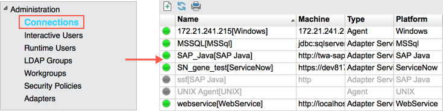

2.	In the **Objects** pane’s header, click **Add** () > **ServiceNow Adapter**.  
The **Connection Definition** dialog will appear.

 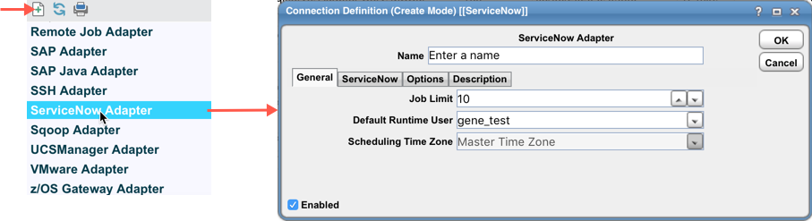

3.	Configure connection parameters, then click **OK**:

  * In the **Name** field, enter a name for a connection you create (any alphanumeric sequence; max 30 symbols).

    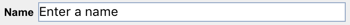

  *	On the **ServiceNow** tab, in the **ServiceNow URL** field, enter the URL of the ServiceNow instance you’d like to integrate with.

    

  * On the **ServiceNow** tab, in the **User** drop-down list, select the user by which you log into the ServiceNow instance specified for integration.

    

The configured connection will appear in the **Objects** pane. The connection’s green indicator shows the availability of the server.

---

## Setting Actions

To set an action, follow the steps:

1.	In the **Definitions** section of the **Navigation** pane, select **Actions** > **ServiceNow**.  
The **ServiceNow Actions** section will be shown in the **Objects** pane.

  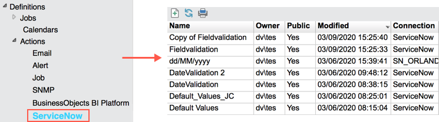

2.	In the **Objects** pane’s header, click **Add** ().  
The **Action Definition** dialog will be opened.

  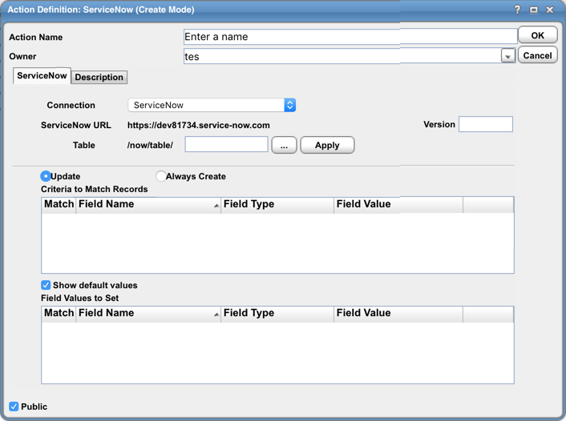

3.	Configure action parameters, then click **OK**:

  * In the **Action Name** field, enter a name of the action you create (any alphanumeric sequence; max 64 symbols).

    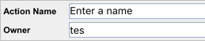

  * On the **ServiceNow** tab, in the **Connection** drop-down list, select a ServiceNow instance where the action will be performed.

    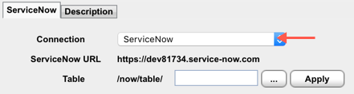

  * On the **ServiceNow** tab, in the **Table** field, either enter the table name or select the one in the **Find Table** dialog (click **Ellipses** ()   and perform a search). Then click **Apply**.

    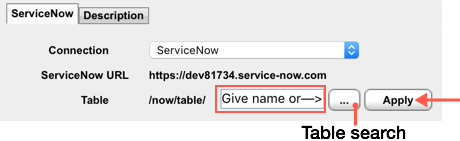

    An indicated table will be uploaded in the fields below.

    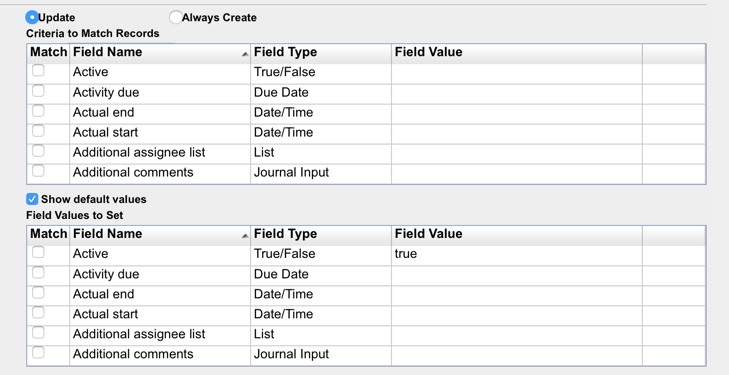

  * Select an option to be used upon working with the table:

    * **Update** — the records matching the criteria specified below will be updated; if no matchings found, the records will be created.

      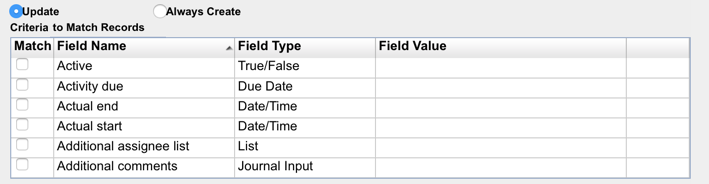

    * **Always Create** — matching is disabled, records will be created by default.

      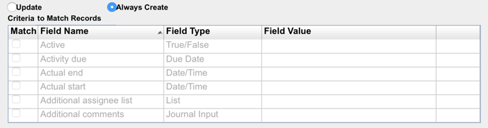

  * If the **Update** option is selected, then in the **Criteria to Match Records** table, select the applicable criteria (the **Match** column) and indicate their values (double-click the line > indicate **Field Value**) to search for the corresponding records in the ServiceNow instance.

  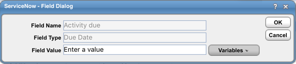

  :::note
  Before specifying date and time values, consult to the **"Date and Time Prerequisites"** section.
  :::

  :::caution
  The system addresses a table with no criteria selected as all criteria selected.
  :::

  :::caution
  Selecting too many criteria may cause performance issues. To handle such issues, narrow your criteria range or increase the JVM memory capacity of the Tidal Automation Adapter for ServiceNow®.
  :::

  * Click **Validate records count** to check the number of the indicated records against the limit specified for this connection (green indicator — validated, red indicator — unvalidated).

  *	If the **Always Create** option is selected, then skip to the last step (search by criteria makes no sense).

  *	In the **Field Values to Set** table, select the applicable criteria (the **Match** column) and indicate the values (double-click the line > indicate **Field Value**) to be entered into the corresponding fields of the ServiceNow table upon action execution.

  :::note
  Before specifying date and time values, consult to the **"Date and Time Prerequisites"** section.
  :::

The configured action will appear in the **Objects** pane.

---

## Setting Events

To set an event, follow the steps:

1.	In the **Definitions** section of the **Navigation** pane, select **Events** > **ServiceNow**.  
The **ServiceNow Events** section will appear in the **Objects** pane.

  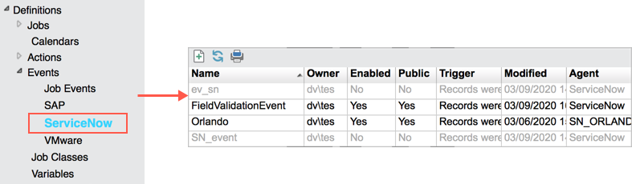

2.	In the **Objects** pane’s header, click **Add** ( ).  
The **Event Definition** dialog will be opened.

  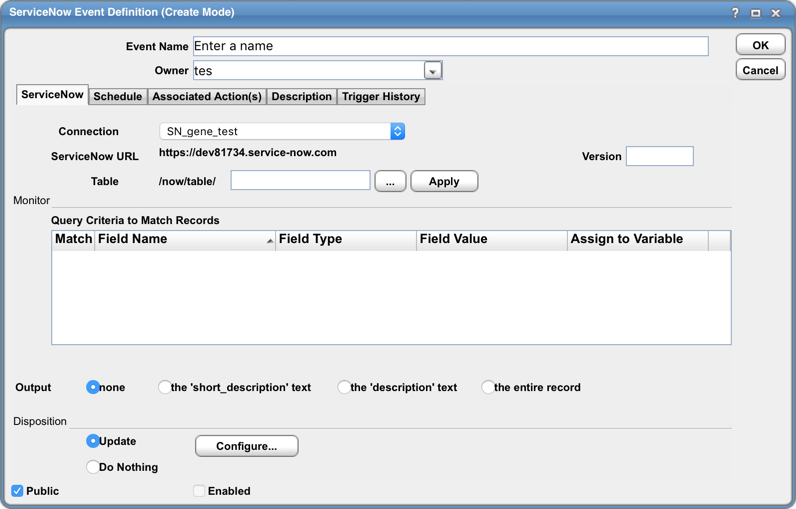

3.	In the **Event Name** field, enter a name for the event you create (any alphanumeric sequence; max 64 symbols).

  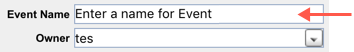

4.	Configure parameters on the **ServiceNow** tab:

  * In the **Connection** drop-down list, select a ServiceNow instance you’d like to connect to.

  * On the **ServiceNow** tab, in the **Table** field, either enter the table name or select the one in the **Find Table** dialog (click **Ellipses** ()   and perform a search). Then click **Apply**.

    

    An indicated table will be uploaded in the Monitor section of the dialog.

    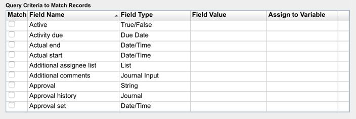

  * In the table, select the applicable criteria (the **Match** column) and indicate the values (right-click the line > select **Edit Field Value** > indicate **Field Value**) by which the corresponding records to be searched in the ServiceNow instance.

  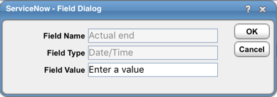

  :::note
  Before specifying date and time values, consult to the **"Date and Time Prerequisites"** section.
  :::

  * In the table, select the applicable criteria (the **Match** column) and indicate the variable name (right-click the line > select **Edit Assign to Variable** > enter the **Assign to Variable** value) to which the values of the corresponding field are to be assigned in the ServiceNow instance.

  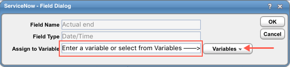

  :::note
  If you are to deal with date and time values, then consult to the **"Date and Time Prerequisites"** section before indicating your values.
  :::

  * Select **Output** (can be shown in **Alerts**):

    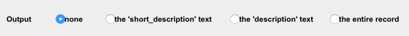

    * **None** — no output will be displayed.  
    * **Short description** — output will be taken from the corresponding field of the ServiceNow table.

      :::note
      If there is no such field in the ServiceNow instance, the **Output** value will be set to **None**.
      :::

    * **Description** — output will be taken from the corresponding field of the ServiceNow table.

      :::note
      If there is no such field in the ServiceNow instance, the **Output** value will be set to **None**.
      :::

    * **Entire record** — output will include all the fields of the ServiceNow record.

  * Select **Disposition** (an action to be performed with the ServiceNow records’ data upon event triggering):

    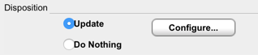

    * **Update** — to update the table, indicate the corresponding values (click **Configure**).
    * **Do nothing** — no updates are needed.

5.	Configure parameters on the **Schedule** tab:

  * In the **Calendar Name** dropdown list, select the corresponding calendar.

    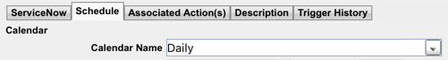

  * Select the start and end dates of the schedule (in the **From**/**To** fields).

    

6.	On the **Associated Actions** tab, move the applicable actions from the **Available Actions** to the **Selected Actions** box (left/right arrows).

  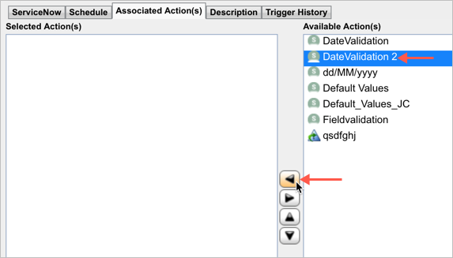

  :::note
  An event can be enabled if it contains at least one associated action.
  :::

7.	Click **OK** to save the configured event.

The configured event will appear in the **Objects** pane.
